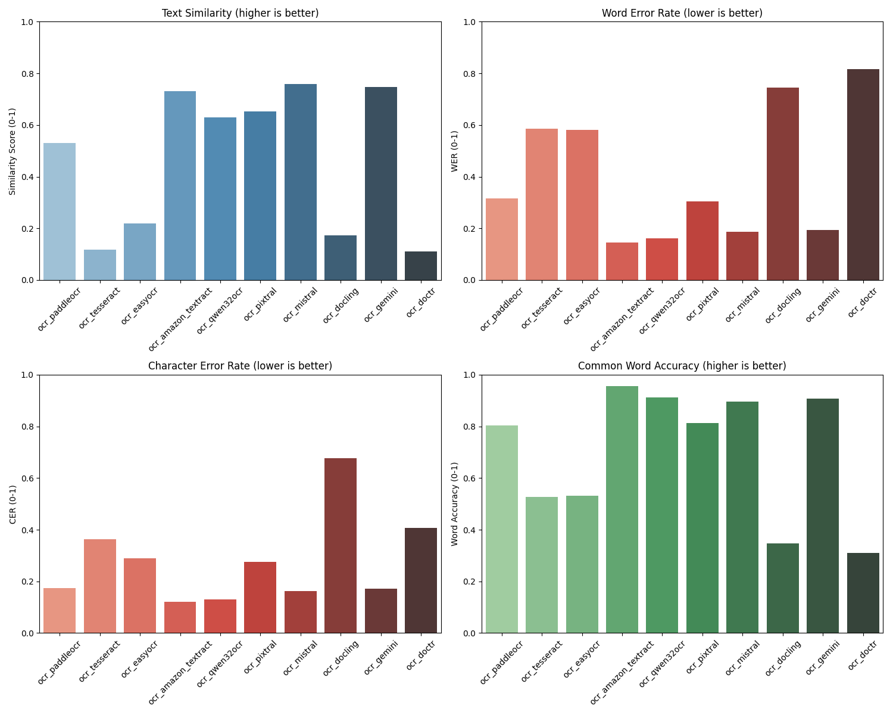

# OCR vs VLM-OCR: Naive Benchmarking Accuracy for Scanned Documents

This article will be the steping stone for a long series of articles about designing a robust and highly efficient knowledge base. 

## Problem Statement

Why did i start with this benchmark ? Because Scanned documents are a huge pain to deal with and are still a huge part of the work of a lot of companies.

When i first searched for this subject, i found a surprising lack of comprehensive benchmarks comparing traditional OCR methods with VLM-based approaches, particularly for scanned document processing.

Which motivated me to create this quick/naive benchmark.

Why naive? because i didn't want to spend time on this, so i just used the funsd dataset and a few models. I also didn't do any pre-processing of the images since i was just looking for a quick benchmark and pre-processing is a whole can of worms.

I explored some quick preprocessing like denoising, binarization, and resizing, but i didn't spend time on it since i was not seeing a huge difference in accuracy. ( sometimes even a big drop in accuracy)


This gap prompted me to create a quick benchmark comparing various OCR technologies against ground truth data from the FUNSD dataset (Form Understanding in Noisy Scanned Documents), with a specific focus on understanding how VLMs perform relative to established OCR methods.

The point is mainly to see how well VLMs perform compared to traditional OCR methods.

On this post, we will focus on the benchmark and the results 
as the hole code is available on github[here](https://github.com/erraji-badr/ocr_benchmarking) with an exhaustive Readme on how to recreate and use it locally. 

Don't hesitate to clone and improve it and issue a PR :) 


## Approach Overview

I developed a comprehensive benchmarking toolkit that evaluates multiple OCR methods across several key metrics:

1. **Multiple OCR Technologies**: Compared 10 different OCR solutions across three categories:
   - Traditional OCR engines (Tesseract)
   - Deep learning OCR models (EasyOCR, PaddleOCR, DocTR, Docling, KerasOCR)
   - Vision-Language Models (Qwen, Mistral, Pixtral, Gemini)
   - Amazon Textract (for comparison)

2. **Standardized Dataset**: Used the FUNSD dataset of noisy scanned forms with precise annotations for consistent evaluation.
example of images from the dataset:


3. **Multi-faceted Evaluation**: Assessed performance using complementary metrics including text similarity, word error rate (WER), character error rate (CER), common word accuracy, and processing time.

4. **Ground Truth Validation**: Generated ground truth from both dataset annotations and VLM ( Gemini 2.5 with reflection) outputs to provide multiple reference points.

## Step-by-Step Process

### 1. Dataset Preparation

The benchmark uses the [FUNSD (Form Understanding in Noisy Scanned Documents)](https://guillaumejaume.github.io/FUNSD/) dataset, which consists of noisy scanned forms with annotations for text, layout, and form understanding tasks.

I created a reproducible sampling process from the FUNSD dataset:

```
dataset/
  testing_data/
    images/         # PNG files of scanned forms
    annotations/    # JSON annotations with text fields, bounding boxes, etc.
```

This ensures consistent testing across OCR methods and enables others to replicate the benchmark using the same document set.

### 2. Ground Truth Generation

The benchmark has one ground truth source and one VLM-based high-performance reference:

**Annotation-based ground truth** extracted from the FUNSD dataset:

```json
{
  "85240939.png": "THE TOBACCO INSTITUTE\nSHERATON-CARLTON HOTEL\nFIFTH ANNUAL\nFEBRUARY 19-21, 1980\nWASHINGTON D.C.\nCOLLEGE OF TOBACCO KNOWLEDGE\nREGISTRATION FORM\n\nNAME: GEORGE R. TELFORD\nTITLE: Brand Manager\nCOMPANY: Lorillard\nADDRESS: 666 Fifth Avenue, New York, NY 10019\nPHONE: (212) 841-8787\n\nCHECK ONE:\n[ ] Please reserve a room for me at the Sheraton-Carlton\n[X] I will make my own housing arrangements.\n\nARRIVAL DATE AND TIME: 2/18/80 7:00 P.M.\nDEPARTURE DATE AND TIME: 2/21/80 4:00 P.M.",
  
  "93106788.png": "LORILLARD MEDIA SERVICES\nONE PARK AVENUE, NEW YORK, NY 10016-5896\n\nMAGAZINE INSERTION ORDER\n\nTO: ESSENCE\n1500 BROADWAY\nNEW YORK, NY 10036\n\nDATE: MARCH 17, 1995\n\nADVERTISER: LORILLARD\nATTN: JOYCE WINSTON\nPRODUCT: NEWPORT"
}
```

**VLM-based ground truth** using high-performance models like Gemini 2.5 with reflection:

The VLM-based approach generates more structured and sometimes more complete text extraction:

```json
{
  "85240939.png": {
    "markdown": "# THE TOBACCO INSTITUTE\n## FIFTH ANNUAL COLLEGE OF TOBACCO KNOWLEDGE\n### REGISTRATION FORM\n\n**SHERATON-CARLTON HOTEL**  \n**WASHINGTON, D.C.**  \n**FEBRUARY 19-21, 1980**\n\n**NAME:** GEORGE R. TELFORD  \n**TITLE:** Brand Manager  \n**COMPANY:** Lorillard  \n**ADDRESS:** 666 Fifth Avenue, New York, NY 10019  \n**PHONE:** (212) 841-8787\n\n**CHECK ONE:**  \n- [ ] Please reserve a room for me at the Sheraton-Carlton  \n- [X] I will make my own housing arrangements.\n\n**ARRIVAL DATE AND TIME:** 2/18/80 7:00 P.M.  \n**DEPARTURE DATE AND TIME:** 2/21/80 4:00 P.M.\n\nPlease attach a brief (50 words or so) autobiographical sketch. Note your first name or nickname, your current professional responsibilities, employment background and whatever personal information you feel would be helpful in giving your fellow students an idea of your activities and interests. The sketches will be assembled and provided at the opening class session.\n\nAny questions? Call Connie Drath or Carol Musgrave at 800/424-9876.\n\n**PLEASE RETURN IN SELF-ADDRESSED ENVELOPE BY FRIDAY, JANUARY 18, 1980**",
    "category": "form",
    "tags": ["registration", "tobacco", "conference", "hotel"]
  },
  
  "93106788.png": {
    "markdown": "# LORILLARD MEDIA SERVICES\n**ONE PARK AVENUE, NEW YORK, NY 10016-5896**\n\n## MAGAZINE INSERTION ORDER\n\n**TO:**  \nESSENCE  \n1500 BROADWAY  \nNEW YORK, NY 10036  \nATTN: JOYCE WINSTON\n\n**DATE:** MARCH 17, 1995\n\n**ADVERTISER:** LORILLARD  \n**PRODUCT:** NEWPORT\n\n**THIS ADVERTISEMENT COMPLIES WITH THE FTC REQUIREMENT FOR A WARNING STATEMENT AND TAR AND NICOTINE LINE WHICH MUST APPEAR IN ALL CIGARETTE ADVERTISING.**",
    "category": "business document",
    "tags": ["advertisement", "magazine", "tobacco", "insertion order"]
  }
}
```

This dual approach allows evaluation against both human-annotated data and state-of-the-art VLM interpretations. The VLM approach often captures more context and formatting, while annotation-based ground truth tends to be more direct.

### 3. OCR Implementation

I created a modular framework for running different OCR methods with a consistent interface:

```python
def ocr_tesseract(image_path: str) -> str:
    """Extract text from image using Tesseract OCR"""
    import cv2
    import pytesseract
    
    # Read and preprocess image
    img = cv2.imread(image_path)
    gray = cv2.cvtColor(img, cv2.COLOR_BGR2GRAY)
    _, binary = cv2.threshold(gray, 150, 255, cv2.THRESH_BINARY | cv2.THRESH_OTSU)
    
    # Run OCR
    text = pytesseract.image_to_string(binary)
    return text
```

Each method follows the same pattern, allowing straightforward comparison and extension to new OCR technologies.

### 4. Benchmark Execution

The benchmark runs all OCR methods against the sample dataset:

```python
def process_dataset(
    image_dir: str, ocr_methods: List, sample_limit: Optional[int] = None
) -> List[OCRResult]:
    """Process all images in the dataset with each OCR method

    Args:
        image_dir: Directory containing images to process
        ocr_methods: List of OCR method functions to apply
        sample_limit: Optional limit on number of images to process

    Returns:
        List of OCRResult for each method
    """
    results = []
    image_paths = list(pathlib.Path(image_dir).glob("*.png"))

    for method in ocr_methods:
        extracted_text = {}
        processing_time = {}

        for img_path in tqdm(image_paths, desc=f"Processing with {method.__name__}"):
                text = method(str(img_path))
                ## ... extra rows 

        results.append(
            OCRResult(
                method_name=method.__name__,
                extracted_text=extracted_text,
                processing_time=processing_time,
            )
        )

    return results
```

This processes each image with every specified OCR method and measures execution time.

### 5. Comprehensive Evaluation

I evaluated each OCR method using multiple complementary metrics:

- **Text Similarity**: Overall textual similarity using difflib's SequenceMatcher
- **Word Error Rate (WER)**: Word-level edit distance normalized by reference length
- **Character Error Rate (CER)**: Character-level edit distance for finer-grained assessment
- **Common Word Accuracy**: Percentage of reference words present in the OCR output
- **Processing Time**: Execution time per image

Here's how each metric is implemented:

```python
# Text Similarity - Measures overall textual similarity (higher is better)
def text_similarity(text1: str, text2: str) -> float:
    """Compute sequence similarity ratio between two strings"""
    return SequenceMatcher(None, text1, text2).ratio()

# Word Error Rate - Measures word-level errors (lower is better)
def word_error_rate(reference: str, hypothesis: str) -> float:
    """Calculate Word Error Rate (WER) between reference and hypothesis texts
    
    WER = (S + D + I) / N
    where:
    S is the number of substitutions
    D is the number of deletions
    I is the number of insertions
    N is the number of words in the reference
    """
    ref_words = reference.lower().split()
    hyp_words = hypothesis.lower().split()

    # Initialize the distance matrix
    d = np.zeros((len(ref_words) + 1, len(hyp_words) + 1), dtype=np.int32)
    
    for i in range(len(ref_words) + 1):
        d[i, 0] = i
        
    for j in range(len(hyp_words) + 1):
        d[0, j] = j

    # Fill the distance matrix using Levenshtein algorithm
    for i in range(1, len(ref_words) + 1):
        for j in range(1, len(hyp_words) + 1):
            cost = 0 if ref_words[i - 1] == hyp_words[j - 1] else 1
            d[i, j] = min(
                d[i - 1, j] + 1,      # Deletion
                d[i, j - 1] + 1,      # Insertion
                d[i - 1, j - 1] + cost  # Substitution
            )

    edit_distance = d[len(ref_words), len(hyp_words)]
    
    if len(ref_words) == 0:
        return 1.0 if len(hyp_words) > 0 else 0.0

    return min(1.0, edit_distance / len(ref_words))

# Character Error Rate - Measures character-level errors (lower is better)
def character_error_rate(reference: str, hypothesis: str) -> float:
    """Calculate Character Error Rate (CER) between reference and hypothesis texts"""
    ref_chars = reference.lower()
    hyp_chars = hypothesis.lower()

    # Initialize the distance matrix
    d = np.zeros((len(ref_chars) + 1, len(hyp_chars) + 1), dtype=np.int32)
    
    for i in range(len(ref_chars) + 1):
        d[i, 0] = i
        
    for j in range(len(hyp_chars) + 1):
        d[0, j] = j

    # Fill the distance matrix
    for i in range(1, len(ref_chars) + 1):
        for j in range(1, len(hyp_chars) + 1):
            cost = 0 if ref_chars[i - 1] == hyp_chars[j - 1] else 1
            d[i, j] = min(
                d[i - 1, j] + 1,      
                d[i, j - 1] + 1,      
                d[i - 1, j - 1] + cost  
            )

    edit_distance = d[len(ref_chars), len(hyp_chars)]
    
    if len(ref_chars) == 0:
        return 1.0 if len(hyp_chars) > 0 else 0.0

    return min(1.0, edit_distance / len(ref_chars))

# Common Word Accuracy - Measures coverage of reference words (higher is better)
def common_word_accuracy(reference: str, hypothesis: str) -> float:
    """Calculate the percentage of words in reference that also appear in hypothesis"""
    ref_words = set(reference.lower().split())
    hyp_words = set(hypothesis.lower().split())

    if not ref_words:
        return 0.0

    common_words = ref_words.intersection(hyp_words)
    return len(common_words) / len(ref_words)
```

These metrics provide different perspectives on OCR quality:
- Text similarity gives an overall view of how close the extracted text is to the ground truth
- WER focuses on correctly identified words (with position/order)
- CER provides character-level accuracy for fine-grained analysis
- Common word accuracy shows how well key terms are captured regardless of order

## Results

The benchmark revealed several important insights about the OCR landscape:

### Key Findings

1. **As expected, VLMs Outperform Traditional OCR for Accuracy**
   - VLM models (particularly Qwen and Mistral) achieved text similarity scores up to 3-4 times higher than traditional OCR methods on complex scanned documents.
   - VLMs demonstrated superior performance on documents with complex layouts, handwriting, or poor scan quality.

2. **Performance Trade-offs**
   - While VLMs delivered higher accuracy, they had significantly longer processing times (5-10x slower than traditional OCR engines).
   - Deep learning OCR methods like PaddleOCR and EasyOCR offered a middle ground with better accuracy than Tesseract and faster processing than VLMs.

3. **Error Pattern Differences**
   - Traditional OCR methods struggled with layout interpretation, often failing to properly follow multi-column formats.
   - VLMs excelled at contextual understanding, correctly interpreting forms with tables, checkboxes, and mixed formatting.
   - Character-level errors were most common in traditional OCR, while VLMs occasionally hallucinated text or made semantic interpretation errors.

4. **Method-Specific Strengths**
   - **Tesseract**: Fast but struggled with complex layouts
   - **PaddleOCR**: Good balance of speed and accuracy
   - **Qwen-VLM**: Highest overall accuracy but slowest processing time
   - **Mistral-VLM**: Strong layout understanding with competitive accuracy

### Visual Comparison



This visualization shows how each OCR method performs across text similarity, word error rate, character error rate, and common word accuracy. The VLM models (particularly Qwen and Mistral) consistently show higher accuracy metrics than traditional OCR methods.

### Processing Time Analysis - 
Not so relevant since sometimes i used GPU T4 and sometimes mps.
And for VLM, i used Openrouter with no regars to optimize inference time. so the routing was not the best.

For time-sensitive applications, the processing time differences are significant:

- **Traditional OCR (Tesseract)**: ~0.5 seconds per image
- **Deep Learning OCR (EasyOCR, PaddleOCR, DocTR, Docling)**: 1-3 seconds per image
- **VLM-based OCR (Qwen, Mistral, Pixtral, Gemini)**: 5-15 seconds per image
 ( it is highly biased as inference time for pixtral was highly dependant on the fact there were no Provider with good inference time and i didn't want to host it on my own ) 


## When to Choose Each Approach

Based on the benchmark results, here are my recommendations for selecting an OCR solution:

1. **High-Volume, Basic Documents, Very low cost**: Traditional OCR engines like Tesseract remain the best choice for processing large volumes of simple, well-formatted documents where speed and cost are critical. no need for expensive backend, no need for GPU, no need for fancy models.

2. **Balanced Requirements**: Deep learning OCR methods like PaddleOCR and DocTR offer a good compromise between accuracy and processing time for most business applications. and with finetuning, they can be even better for the right use case.

3. **Complex Documents with High-Value Information**: VLM-based approaches justify their higher cost and processing time when working with complex documents where accuracy is paramount, such as legal contracts, medical records, or financial statements. 

There are 3 main drawbacks to using VLM-based approaches:
-  The cost of the VLM-based approaches. which can be mitigated by using the right model and provider ( i think of gemini 2.0 cheap, accurante and quick) or self-hosting it ( i think about Qwen2.5 70B for example).
-  The non-deterministic nature of the output of the VLM-based approaches.
-  the data privacy concerns. which can be mitigated by self-hosting the model. ( some infrastructure with GPUs is needed which can is generally more costly)

4. **Handwritten Content**: VLMs significantly outperform traditional OCR for handwritten text, making them the clear choice for documents with substantial handwritten components.

## Future Work

This benchmark provides a foundation for OCR technology selection, but several areas warrant further investigation:

1. **Domain-Specific Testing**: Expanding the benchmark to industry-specific document types (invoices, medical records, etc.)

2. **Multi-Language Evaluation**: Assessing OCR performance across different languages and scripts

3. **Cost-Benefit Analysis**: Developing a framework to balance accuracy improvements against increased processing costs for VLM approaches

## Connect With Me

If you're working on document digitization challenges or have any insights about this, I'd love to connect. Drop a comment below or reach out directly to discuss.


For those interested in running the benchmark themselves or extending it to include additional OCR methods, the complete toolkit is available on GitHub at [OCR Benchmarking](https://github.com/errajibadr/ocr_benchmarking). 